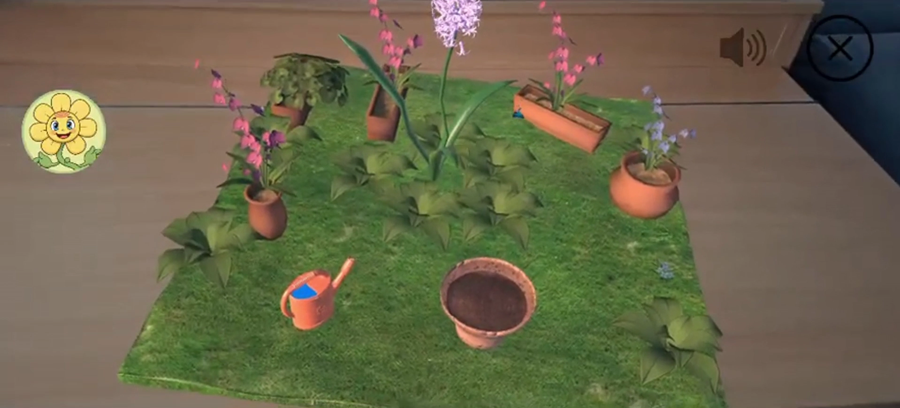

# 🌸 Zumbul (Hyacinth) AR

**An upbeat, edutainment AR experience exploring the beauty and life of the Hyacinth flower.**

---

## 📽️ Preview

*Main view of the Zumbul AR environment featuring Flowey the Flower.*

---

## ✨ About the Project
**Zumbul** (the Bosnian/Turkish word for Hyacinth) is an immersive AR application designed to make learning about botany interactive and fun. 

The project features a high-fidelity **custom 3D model** of a Hyacinth created from scratch in **Blender**, integrated into a lush **Unity** environment. Whether you're learning how to care for a plant or watching its life cycle unfold, Zumbul brings the garden to your living room.

---

## 🎮 Key Features

### 🛠️ Interactive Mechanics
* **Physics-Based AR Dragging:** A custom-coded interaction allowing you to pick up the watering can with your finger and move it through 3D space to interact with the environment.
* **The Growth Trigger:** Use the watering can on the pots to watch new life bloom in real-time.

### 📍 Points of Interest (POIs)
| Feature | Interaction | Description |
| :--- | :--- | :--- |
| **Watering Can** | Tap / Drag | Plays audio instructions on flower maintenance and acts as a tool for growth. |
| **Nature Pot** | Tap | Opens an image gallery showing the Hyacinth in its natural wild habitat. |
| **Animated Butterfly** | Tap | Triggers a cinematic video showing the life cycle and growth of the plant. |

### 🌻 Meet Flowey!
Flowey is your peppy, high-energy UI assistant. He’s "the man" for real — guiding you through every step, explaining what to click, and ensuring you never get lost in the garden.

---

## 🖼️ App Gallery

### 🌻 Meet Flowey (Interactive UI)

*Flowey providing peppy guidance and instructions throughout the app.*

---

### 🎨 Custom Blender Modeling

*The high-fidelity Zumbul model, designed and textured entirely in Blender.*

---

### 💧 AR Interaction & Physics

*A look at the dragging mechanic: Moving the watering can to trigger plant growth.*
---

## 📸 Scan Image (Marker)
To use the app, point your camera at the tracking image below. You can print this out or display it on another device.

---

## 🚀 How to Install
1.  Go to the **[Releases](https://github.com/AwwLivSos/Zumbul/releases)** tab on GitHub.
2.  Download the latest `.apk` file for Android.
3.  Install the app on your AR-compatible device and start growing!

---

## 🛠️ Built With
* **Unity** - Core Engine
* **Blender** - 3D Asset Creation
* **Vuforia** - AR Tracking Engine
* **C#** - Custom Scripts & Logic

---

## 👤 Contact
**Project Creator**
* GitHub: [@AwwLivSos](https://github.com/AwwLivSos)
* Email: dalibegovi2@etf.unsa.ba

*"Keep it peppy and keep growing!"*